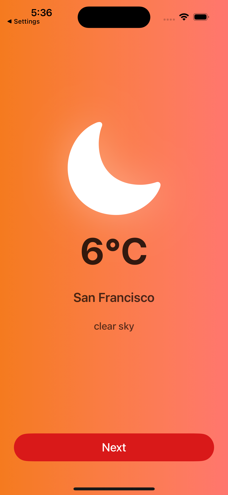
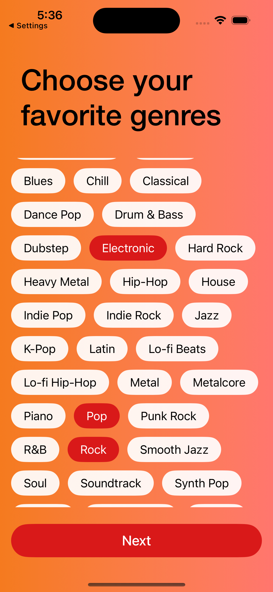
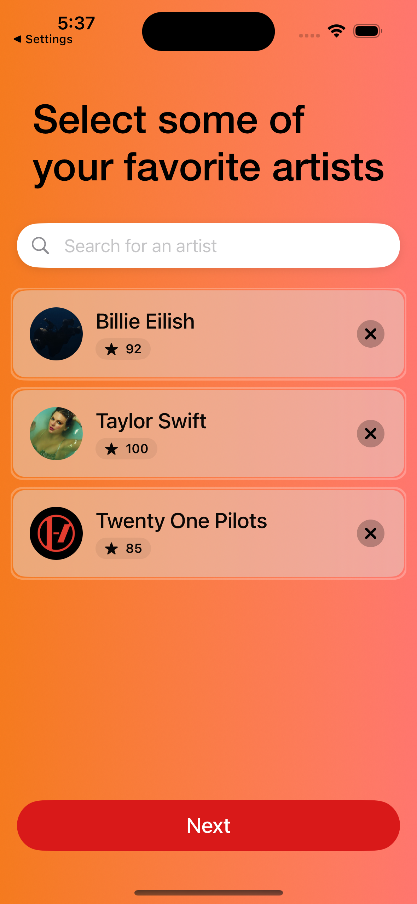
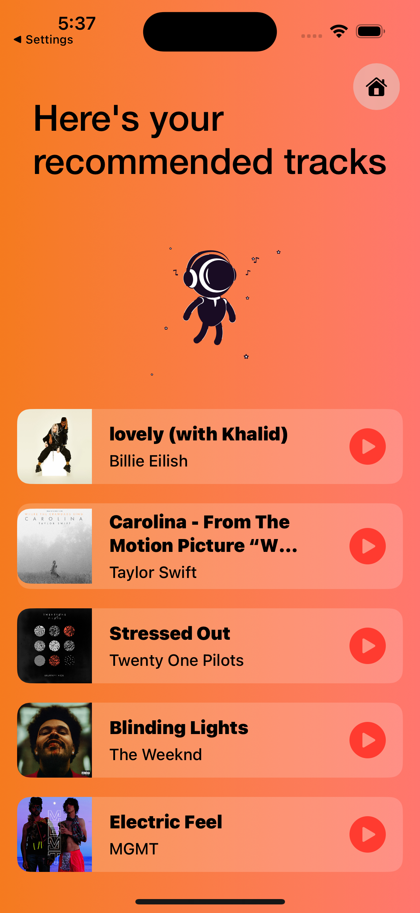

# atmobeats 🎧

---

## 📱 Screenshots

  
  

  
  

---

**atmobeats** is an iOS application that delivers personalized music recommendations based on contextual signals such as weather, selected genres, and favorite artists.

The app is built with **SwiftUI** and communicates with a **.NET Web API backend**, hosted on **Microsoft Azure**.  
The backend leverages **OpenAI** for intelligent recommendation logic and **OpenWeather** for real-time weather data.

This project is designed as a real-world, end-to-end example of a modern mobile application backed by cloud services and AI-powered personalization.

---

## ✨ Features

- 🌦 **Weather-aware recommendations**  
  Music suggestions adapt dynamically based on real-time weather conditions provided by **OpenWeather**.

- 🎶 **Genre-based personalization**  
  Users select preferred genres to influence recommendation results.

- 🎤 **Favorite artists**  
  Recommendations are refined using the user’s favorite artists.

- 🤖 **AI-powered recommendation engine**  
  The backend uses **OpenAI API** to generate smarter, context-aware music recommendations.

- ☁️ **Cloud-hosted backend**  
  The API is deployed on **Azure App Service**, ensuring scalability and reliability.

---

## 🧱 Architecture Overview

### iOS Client
- Built with **SwiftUI**
- MVVM architecture
- Typed navigation and clean routing
- Reactive UI using `ObservableObject` and `@Published`
- Communicates with the backend via REST APIs

### Backend
- **.NET Web API**
- Hosted on **Microsoft Azure**
- Core responsibilities:
  - Aggregating weather data from **OpenWeather**
  - Generating recommendations using **OpenAI**
  - Serving clean, RESTful endpoints to the iOS app

---

## 🌐 External Services

- **OpenAI API**  
  Used to generate intelligent and context-aware music recommendations.

- **OpenWeather API**  
  Provides real-time weather data that directly influences recommendation logic.

